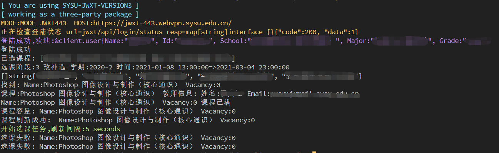

# SYSU_JWXT
  [](https://opensource.org/licenses/MIT)    
:rocket: version 3 of [sysu_jwxt_v2](https://github.com/liwm29/sysu_jwxt_v2) 
<!-- ## TODO
从v2到现在,学到了更多的技术,因此打算升级v2,要做的事情:
- 前后端分离,后端仅作为api服务器
  - 可能涉及跨域的问题
- 前端界面重写,打算基于vue-el-admin二次开发照猫画虎一下
- 单例模式修改为支持多用户登陆
  - 加入cookie/session,支持多客户端
- 后端重构一下代码,整合一下基于sysu.edu.cn/jwxt登陆和基于portal.sysu.edu.cn的webvpn登陆
  - 此前由于jwxt对外网开发,不再需要通过portal跳转webvpn登陆,便丢弃了portal
- 加入mock用户,用于测试,不必真的登陆jwxt
- 教师照片的加载问题,应该改为在可视区域时自动加载,而不是hover()时 -->

## 项目目录结构
- proxyServer作为一个代理服务器,单纯接收来自前端的请求,调用jwxtClient的方法获得数据,然后返回给前端
```sh
.
├── backend
│   ├── jwxtClient
│   │  ├─client
│   │  ├─course
│   │  ├─example
│   │  ├─global
│   │  ├─request
│   │  ├─student
│   │  ├─teacher
│   │  ├─test
│   │  └─util
│   └── proxyServer
└── frontend
     └── dist
```

## JwxtClient
> 将/backend/jwxtClient作为一个第三方库使用
<details>
<summary>Example</summary>

```go
package main

import (
	"errors"
	"fmt"
	"io/ioutil"
	"os"
	jwxtClient "github.com/liwm29/sysu_jwxt_v3/backend/jwxtClient/client"
	"github.com/liwm29/sysu_jwxt_v3/backend/jwxtClient/course"
	"github.com/liwm29/sysu_jwxt_v3/backend/jwxtClient/global"
	"github.com/liwm29/sysu_jwxt_v3/backend/jwxtClient/util"
	"time"
)

func main() {
	// 设置log级别
	global.SetLogLevel_DEBUG()
	// 构造客户端
	c := jwxtClient.NewClient("")
	// 构造登陆表单, 获取验证码,默认将验证码图片下载到"./captcha.jpg", 登陆cli ,都被集成到了jwxtClient.Login()
	isLogin := c.Login()
	if isLogin {
		fmt.Println("登陆成功")
	} else {
		fmt.Println("登陆失败")
		os.Exit(0)
	}

	fmt.Println("已选课程:", course.GetSelectedCourseNames(c))

	// 获取选课阶段,不在选课阶段时,不能使用
	selectPhase := c.GetCoursePhase()
	fmt.Printf("选课阶段:%s %s 学期:%s 时间:%s=>%s\n",
		selectPhase.ElectiveCourseStageCode, selectPhase.ElectiveCourseStageName, selectPhase.SemesterYear,
		selectPhase.StartTime, selectPhase.EndTime)

	// 获取课程列表,专选
	courseList1 := c.GetCourseList(course.NAME_ALL, course.CAMPUS_ALL, course.TYPE_MAJ_ELECTIVE)
	fmt.Printf("%#v\n", courseList1.CourseNames())
	// 东校区,公选
	// courseList2 := c.GetCourseList(course.NAME_ALL, course.CAMPUS_EAST, course.TYPE_PUB_ELECTIVE)
	// fmt.Printf("%#v", courseList2.CourseNames()[:5])

	// 单个课程,比如热门课程photoshop
	course, err := c.GetCourseList("photoshop", course.CAMPUS_ALL, course.TYPE_PUB_ELECTIVE).First()
	if err != nil {
		fmt.Println("未找到课程信息:", err)
	} else {
		fmt.Println("找到:", course.VacancyInfo())
	}

	if course == nil {
		return
	}
	// 课程教师信息
	teachers, err := course.GetTeachers(c)
	if err != nil {
		fmt.Println(err)
	} else {
		if len(teachers) > 0 {
			fmt.Printf("课程:%s 教师信息: 姓名:%s Email:%s\n", course.CourseName(), teachers[0].Name, teachers[0].Email)
		} else {
			fmt.Println("无教师信息")
		}
	}

	// 如果在选课第三阶段
	if !selectPhase.CanSelect() {
		util.PanicIf(errors.New("不在选课阶段" + fmt.Sprintf("%#v", selectPhase)))
	}
	if course.VacancyNum() > 0 {
		isOk := course.Choose(c)
		fmt.Println(course.VacancyInfo(), "选课", isOk)
	} else {
		fmt.Println(course.VacancyInfo(), "课程已满")
	}

	// 退课
	if course.IsSelected() {
		isOk := course.Cancel(c)
		fmt.Println(course.VacancyInfo(), "退课", isOk)
	}

	// 课程剩余名额
	fmt.Println("课程容量:", course.VacancyInfo())

	// 刷新课程剩余名额
	if (course.Refresh(c)) != nil {
		fmt.Println("课程刷新失败")
	} else {
		fmt.Println("课程刷新成功: ", course.VacancyInfo())
	}

	// 教师照片
	teacherId := "123456"
	ioutil.WriteFile("teacher"+teacherId+".jpg", c.GetTeacherImg(teacherId), 0666)

	// 学生照片
	studentId := "123456"
	ioutil.WriteFile("student"+studentId+".jpg", c.GetStudentImg(studentId), 0666)

	// 自动选课,5s查询一次,异步
	isOkChan := course.AutoChoose(c, time.Second*5)
	for err := range isOkChan {
		if err == nil {
			fmt.Println(course.VacancyInfo(), "选课成功")
			break
		}
		fmt.Println(err)
	}
}

```
</details>
<br>



## Lint
`golangci-lint run -D errcheck -D varcheck -D deadcode -D unused`

## Design
<details>
<summary>构造函数多可选参数设计</summary>

```go
type reqOptionSetFunc func(*ReqOptions) ReqOptionSetter

// for further expansion ,use struct to wrap
type ReqOptionSetter struct {
	// value interface{}
	f reqOptionSetFunc
}

func (r *ReqOptionSetter) apply(ropts *ReqOptions) {
	r.f(ropts)
}

func WithCampus(campusId string) ReqOptionSetter {
	return ReqOptionSetter{
		func(ro *ReqOptions) ReqOptionSetter {
			prev := ro.campusId
			ro.campusId = campusId
			return WithCampus(prev)
		},
	}
}

func NewCourseListReq(courseType *CourseType, opts ...ReqOptionSetter) *CourseListReq {
	req := &CourseListReq{
		pageNo:     1,
		pageSize:   10,
		options:    defaultReqOptions(),
		courseType: courseType,
	}
	for _, o := range opts {
		o.apply(&req.options)
	}
	return req
}
```
</details>

## ChangeLog
- 2021/01/08 初始化任务目标, 计划考试后开始
- 2021/01/09 决定前后端分离的模式为:分开开发,合并部署,见 DevLog#1 ,添加了部署代码
- 2021/01/10 确定项目目录结构
- 2021/01/14 增加了request组件,为对http.request/response/client的简单封装
- 2021/01/15 增加并测试了cookie管理,迁移了登陆,选课,退课实现
- 2021/01/17 增加并测试了查询课程列表和单一课程功能
- 2021/01/20~2021/01/23 jwxtClient初步完成
- 2021/01/29 修复了cookiejar的bug,添加了jwxt443的接口,可在校外通过webvpn访问jwxt
- 2021/02/09 修改了

## OTHER
<details>
<summary>DevLog</summary>

1. 前后端分离,肯定要分离开发,至于是否分离部署,看个人需要
   1. 如果分离部署,这是在说前端代码`npm run build`后,将`/dist`目录直接扔进nginx或tomcat,后端作为api服务器单独运行在另一个端口
      1. 由于端口不同,涉及CORS跨域资源共享问题,对xhr请求的发出没影响,主要是响应必须带有`Access-Control-Allow-Origin`,否则被浏览器拦截;dom的请求似乎直接禁止了,防止冒牌网站直接套壳iframe;具体如何,没试过
   2. 如果一起部署,也就是虽然后端服务器是作为api服务器,但是当请求`'/'`时,便返回`html`,其余的路由都是api
      1. 这在go中很容易实现,但其实不算太优雅,毕竟api服务器多了几条ServeFile代码,动态路由的html(指访问`/`而不是`/index.html`)和其他静态文件都由api服务器响应
2. cli的表格打印
   1. 如果数据单元是中文这种rune时,计算宽度时和普通的ascii是不同的
   2. 一般的utf8.RuneCountInString计算中文字符串会得到错误的宽度,可以使用 github.com/mattn/go-runewidth 这个库
</details>